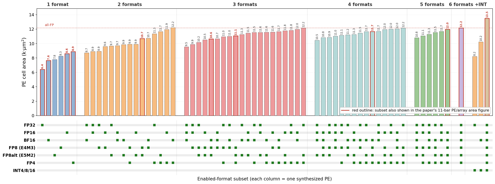

# TransDot — Transprecision Dot-Product FPU

TransDot extends [FPnew](https://github.com/pulp-platform/fpnew) with transprecision dot-product (DP) support across FP32, FP16, FP8, and FP4 formats, plus SIMD FMA operations — all in a single fused datapath with area parity to the FPnew baseline.

## Quickstart

```bash
source sourceme.sh
```

### Full TransDot Regression (FP32/FP16/FP8 scalar + SIMD + DP)

```bash
cd tb/sv_tb_new
export FPNEW_HOME=$(git rev-parse --show-toplevel)
vcs -sverilog -full64 -f filelist.f -top tb_fpnew -o simv -timescale=1ns/1ps
./simv +TESTMODE=simd    # runs all formats: scalar, SIMD, DP
```

Expected: **2048/2048** vectors pass (256 per format × 8 formats).

### No-DP Variant Regression (FP32/FP16/FP8 scalar + SIMD only)

```bash
cd tb/sv_tb_new
export FPNEW_HOME=$(git rev-parse --show-toplevel)
vcs -sverilog -full64 \
  -f $FPNEW_HOME/src/transdot_no_dp/filelist_best.f \
  +define+SIMULATION \
  $FPNEW_HOME/tb/sv_tb_new/tb_fpnew.sv \
  -top tb_fpnew -o simv_nodp -timescale=1ns/1ps
./simv_nodp +TESTMODE=simd
```

Expected: **1280/1280** vectors pass (256 per format × 5 formats). DP tests show 0/256 (expected — DP disabled).

### Gate-Level Simulation

After synthesis, verify the netlist:

```bash
cd tb/sv_tb_new
vcs -sverilog -full64 \
  -f filelist_syn.f \
  -top tb_fpnew_syn -o simv_syn -timescale=1ns/1ps
./simv_syn +TESTMODE=scalar
./simv_syn +TESTMODE=simd
```

## Repository Structure

```
src/                          # RTL source
  transdot_fp4_fp8_fp16_fp32_fma_opt.sv  # Full TransDot FMA (DP + SIMD)
  transdot_decomp_*.sv                    # Decomposed datapath modules
  fpnew_*.sv                              # FPnew base modules
  transdot_no_dp/                         # No-DP single-module variant
    transdot_fp16_fp32_fma_simd_base.sv   # Best no-DP design (5-12% smaller than FPnew)
    filelist_best.f                        # Filelist for synthesis/simulation
tb/                           # Testbenches and test data
syn/                          # Synthesis scripts (gitignored outputs)
instances/                    # FPU wrapper instances
docs/                         # Documentation
```

## Synthesis

For the no-DP variant, comment out `auto_ungroup none` in the synthesis script to enable flattening (yields 5-12% area savings vs FPnew baseline at all timing points).

### Area vs. enabled-format subset

`FpFmtMask` (plus the runtime `src_fmt` masking used by the sweep wrappers)
lets Genus prune the slices of disabled formats, so PE area scales with the
format subset that is actually turned on. The figure below sweeps every
non-empty subset of {FP32, FP16, BF16, FP8 (E4M3), FP8alt (E5M2), FP4} --
63 synthesis runs -- plus three INT-enabled configurations.



Post-synthesis cell area of one 2-term dot-product PE (Genus 25.10,
TSMC 28 nm, SS 0.72 V / 125 C, 1 GHz target, `ADDMUL_ONLY_PIPE3`), grouped by
number of enabled formats and sorted by area within each group; the matrix
below each bar gives the enabled subset. Range: 6.40k um^2 (FP32 only) to
12.16k um^2 (all six FP formats) to 13.49k um^2 (all FP + INT4/8/16). Mean
marginal cost of enabling one more format: FP32 +0.31k, FP8 +0.47k,
FP16 +0.60k, BF16 +0.71k, FP8alt +0.84k, FP4 +1.70k um^2 -- strongly
non-additive, since the formats share datapath.

Sweep driver, per-case synthesis dirs, and the plotting script live in the
`multi-format-systolic-array` repository under `syn/pe_area_sweep/`.

---

# FPnew - New Floating-Point Unit with Transprecision Capabilities

Parametric floating-point unit with support for standard RISC-V formats and operations as well as transprecision formats, written in SystemVerilog.

Maintainers: Pasquale Davide Schiavone <davide@openhwgroup.org>, Pascal Gouedo <pascal.gouedo@dolphin.fr><br>
Authors: Stefan Mach <smach@iis.ee.ethz.ch>, Luca Bertaccini <lbertaccini@iis.ee.ethz.ch>

## Features

The FPU is a parametric design that allows generating FP hardware units for various use cases.
Even though mainly designed for use in RISC-V processors, the FPU or its sub-blocks can easily be utilized in other environments.
Our design aims to be compliant with IEEE 754-2008 and provides the following features:

### Formats
Any IEEE 754-2008 style binary floating-point format can be supported, including single-, double-, quad- and half-precision (`binary32`, `binary64`, `binary128`, `binary16`).
Formats can be defined with arbitrary number of exponent and mantissa bits through parameters and are always symmetrically biased.
Multiple FP formats can be supported concurrently, and the number of formats supported is not limited.

Multiple integer formats with arbitrary number of bits (as source or destionation of conversions) can also be defined.

### Operations
- Addition/Subtraction
- Multiplication
- Fused multiply-add in four flavours (`fmadd`, `fmsub`, `fnmadd`, `fnmsub`)
- Division<sup>1,2</sup>
- Square root<sup>1,2</sup>
- Minimum/Maximum<sup>3</sup>
- Comparisons
- Sign-Injections (`copy`, `abs`, `negate`, `copySign` etc.)
- Conversions among all supported FP formats
- Conversions between FP formats and integers (signed & unsigned) and vice versa
- Classification

Multi-format FMA operations (i.e. multiplication in one format, accumulation in another) are optionally supported.

Optionally, *packed-SIMD* versions of all the above operations can be generated for formats narrower than the FPU datapath width.
E.g.: Support for double-precision (64bit) operations and two simultaneous single-precision (32bit) operations.

It is also possible to generate only a subset of operations if e.g. divisions are not needed.

<sup>1</sup>Some compliance issues with IEEE 754-2008 are currently known to exist for the PULP DivSqrt unit (Rounding mismatches have been reported in GitHub issues. This can lead to results being off by 1ulp, and the inexact flag not being properly raised in these cases as well)<br>
<sup>2</sup>Two DivSqrt units are supported: the multi-format PULP DivSqrt unit and a 32-bit unit integrated from the T-Head OpenE906. The `PulpDivsqrt` parameter can be set to 1 or 0 to select the former or the latter unit, respectively.<br>
<sup>3</sup>Implementing IEEE 754-201x `minimumNumber` and `maximumNumber`, respectively

### Rounding modes
All IEEE 754-2008 rounding modes are supported, namely
- `roundTiesToEven`
- `roundTiesToAway`
- `roundTowardPositive`
- `roundTowardNegative`
- `roundTowardZero`

### Status Flags
All IEEE 754-2008 status flags are supported, namely
- Invalid operation (`NV`)
- Division by zero (`DZ`)
- Overflow (`OF`)
- Underflow (`UF`)
- Inexact (`NX`)

## Getting Started

### Dependencies

FPnew currently depends on the following:
- `lzc` and `rr_arb_tree` from the `common_cells` repository (https://github.com/pulp-platform/common_cells.git)
- optional: Divider and square-root unit from the `fpu-div-sqrt-mvp` repository (https://github.com/pulp-platform/fpu_div_sqrt_mvp.git)

These two repositories are included in the source code directory as git submodules, use
```bash
git submodule update --init --recursive
```
if you want to load these dependencies there.

Consider using [Bender](https://github.com/fabianschuiki/bender.git) for managing dependencies in your projects. FPnew comes with Bender support!

### Usage

The top-level module of the FPU is called `fpnew_top` and can be directly instantiated in your design.
Make sure you compile the package `fpnew_pkg` ahead of any files making references to types, parameters or functions defined there.

It is discouraged to `import` all of `fpnew_pkg` into your source files. Instead, explicitly scope references into the package like so: `fpnew_pkg::foo`.

#### Example Instantiation

```SystemVerilog
// FPU instance
fpnew_top #(
  .Features       ( fpnew_pkg::RV64D          ),
  .Implementation ( fpnew_pkg::DEFAULT_NOREGS ),
  .TagType        ( logic                     )
) i_fpnew_top (
  .clk_i,
  .rst_ni,
  .operands_i,
  .rnd_mode_i,
  .op_i,
  .op_mod_i,
  .src_fmt_i,
  .dst_fmt_i,
  .int_fmt_i,
  .vectorial_op_i,
  .simd_mask_i,
  .tag_i,
  .in_valid_i,
  .in_ready_o,
  .flush_i,
  .result_o,
  .status_o,
  .tag_o,
  .out_valid_o,
  .out_ready_i,
  .busy_o
);
```

### TransDot Mode Encoding (Breaking API)

TransDot mode control is opcode-driven in `fpnew_pkg::operation_e`. The legacy public sideband controls were removed from top-level/wrapper interfaces:

- `dp_enable_i`
- `simd_enable_i`
- `fp4_enable_i`

Use explicit operation IDs instead:

- `TDOT_SIMD_FMADD` (`16`): merged SIMD FMA mode
- `TDOT_DP_FMADD` (`17`): dot-product accumulation mode
- `TDOT_FP4_DP_FMADD` (`18`): FP4 (E2M1) dot-product accumulation mode

FP4 is now a first-class format (`FP4`) selected through `src_fmt_i`/`dst_fmt_i`.

### Documentation

More in-depth documentation on the FPnew configuration, interfaces and architecture is provided in [`docs/README.md`](docs/README.md).

### Issues and Contributing

In case you find any issues with FPnew that have not been reported yet, don't hesitate to open a new [issue](https://github.com/pulp-platform/fpnew/issues) here on Github.
Please, don't use the issue tracker for support questions.
Instead, consider contacting the maintainers or consulting the [PULP forums](https://pulp-platform.org/community/index.php).

In case you would like to contribute to the project, please refer to the contributing guidelines in [`docs/CONTRIBUTING.md`](docs/CONTRIBUTING.md) before opening a pull request.


### Repository Structure

HDL source code can be found in the `src` directory while documentation is located in `docs`.
A changelog is kept at [`docs/CHANGELOG.md`](docs/CHANGELOG.md).

This repository loosely follows the [GitFlow](https://nvie.com/posts/a-successful-git-branching-model/) branching model.
This means that the `master` branch is considered stable and used to publish releases of the FPU while the `develop` branch contains features and bugfixes that have not yet been properly released.

Furthermore, this repository tries to adhere to [SemVer](https://semver.org/), as outlined in the [changelog](docs/CHANGELOG.md).

## Licensing

FPnew is released under the *SolderPad Hardware License*, which is a permissive license based on Apache 2.0. Please refer to the [SolderPad license file](LICENSE.solderpad) for further information.

The T-Head E906 DivSqrt unit, integrated into FPnew in [`vendor/opene906`](vendor/opene906), is reseased under the *Apache License, Version 2.0*. Please refer to the [Apache 2.0 license file](LICENSE.apache) for further information.

## Publication

If you use FPnew in your work, you can cite us:

<details>
<summary>FPnew Publication</summary>
<p>

```
@article{mach2020fpnew,
  title={Fpnew: An open-source multiformat floating-point unit architecture for energy-proportional transprecision computing},
  author={Mach, Stefan and Schuiki, Fabian and Zaruba, Florian and Benini, Luca},
  journal={IEEE Transactions on Very Large Scale Integration (VLSI) Systems},
  volume={29},
  number={4},
  pages={774--787},
  year={2020},
  publisher={IEEE}
}
```

</p>
</details>


## Acknowledgement

This project has received funding from the European Union's Horizon 2020 research and innovation programme under grant agreement No 732631.

For further information, visit [oprecomp.eu](http://oprecomp.eu).


